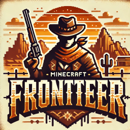

# Frontier
### Java Minecraft Server 2025

   
## Install the Modpack
click on and download the `installer_updater.exe`. Windows will warn you about this file, if you trust me press more info and run it. If not that's ok, the source is included or install yourself.        
Run the installer/updater, and follow instructions from there. Once installed, just run the minecraft launcher and launch Java.           
           
This app can be used to update your modpack to the latest version if the server updates as well. We might keep adding mods or shaders etc.

#### If you can use git yourself
backup or delete your .minecraft folder and you can clone this there (or move it in, keeping your options & saves etc.) then run the minecraft launcher. You can keep it updated by just pulling the main branch.

Enjoy!

### Disclaimer
This repo is intended to hold a java minecraft 1.20.1 client with forge installed along with a bunch of specific mods, shaders, settings, and a few more things. I AM NOT the creator of anything included here other than the installer / updater & the mod compilation. All rights are reserved by each respective creator / owner. This is just for my friends and I to quickly setup a client for our server on any windows pc with minecraft, and importantly **a real minecraft account is required even after downloading this pack** just as you'd expect.
